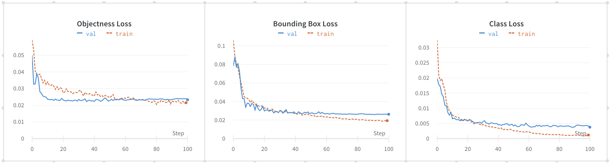
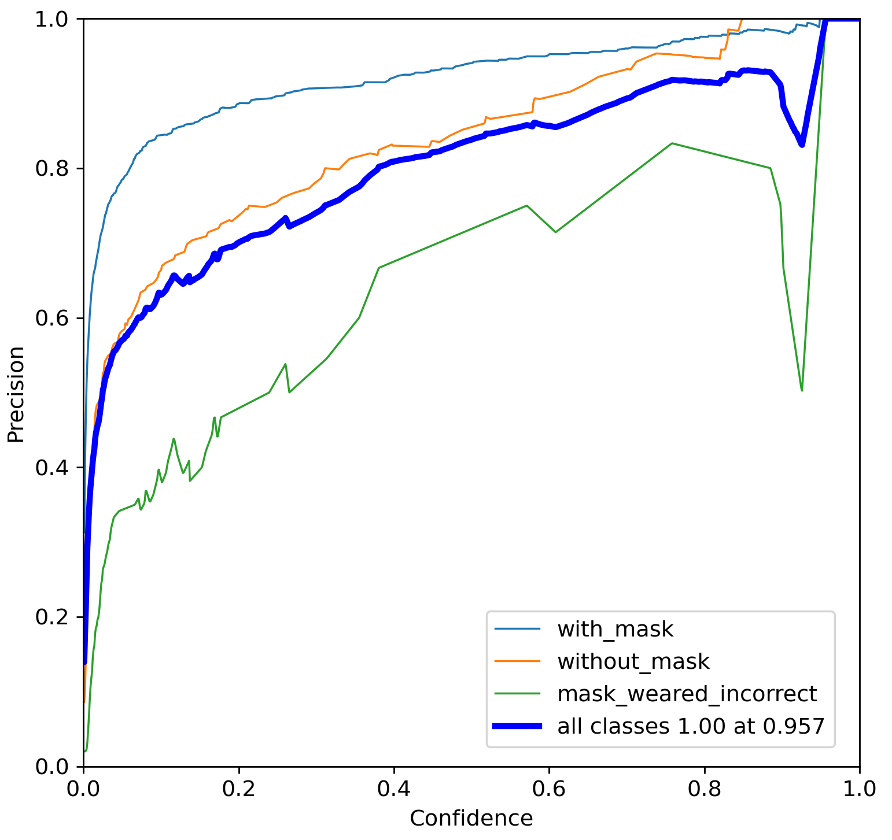
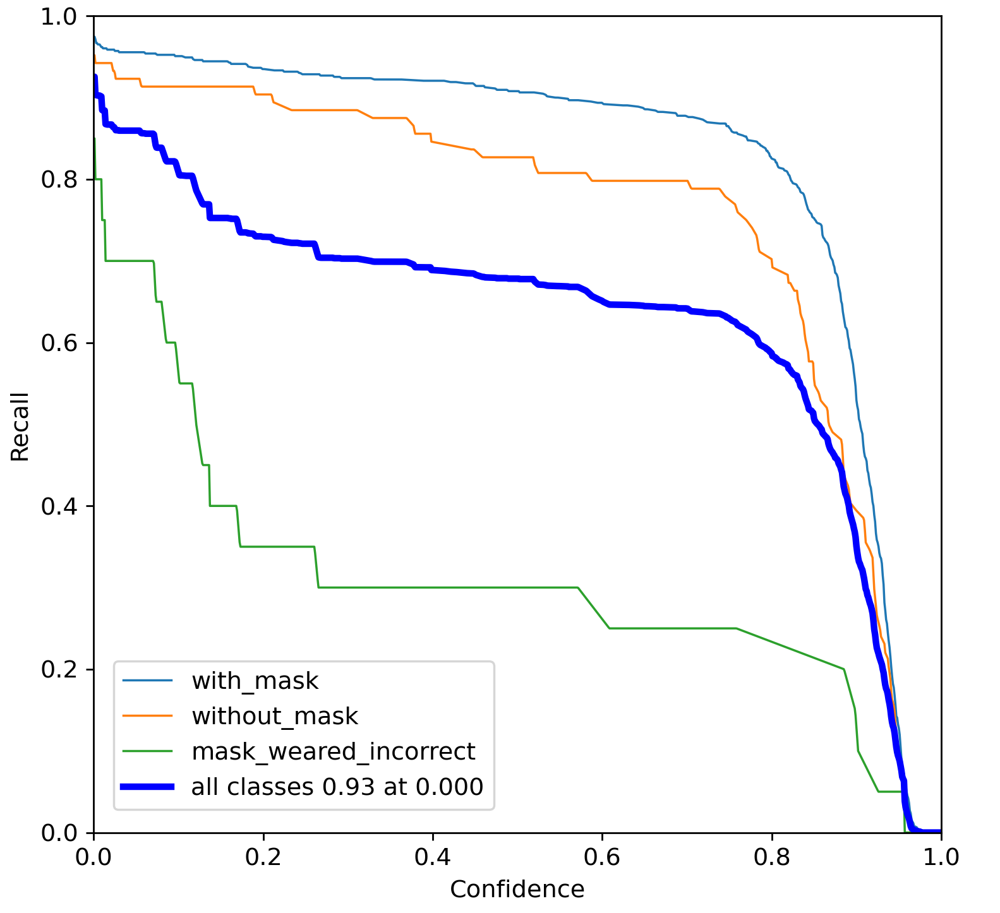
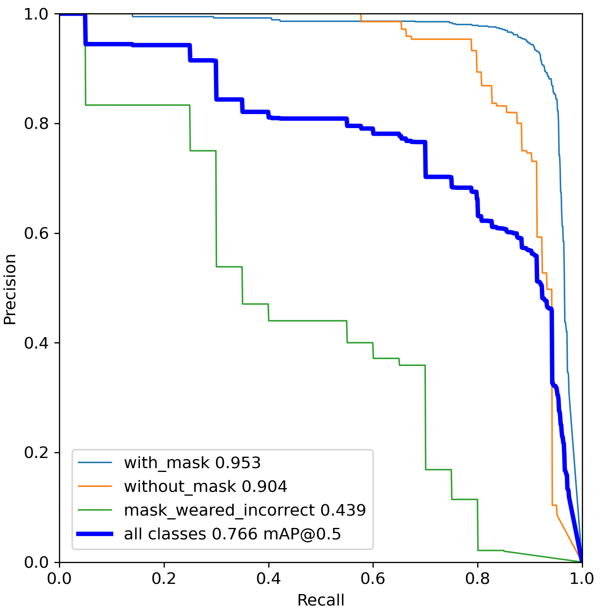
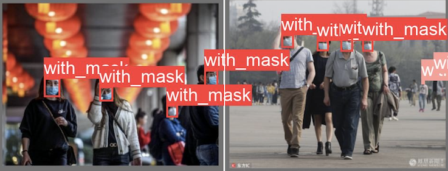
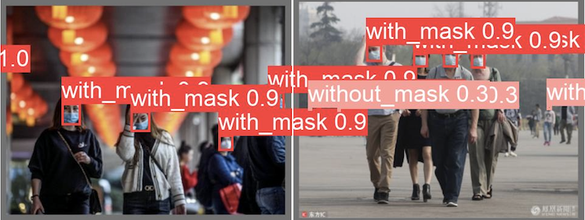
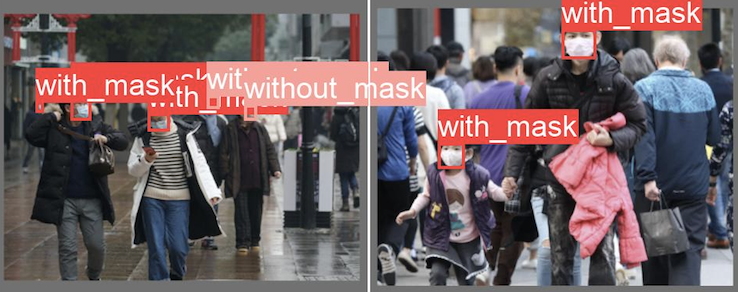
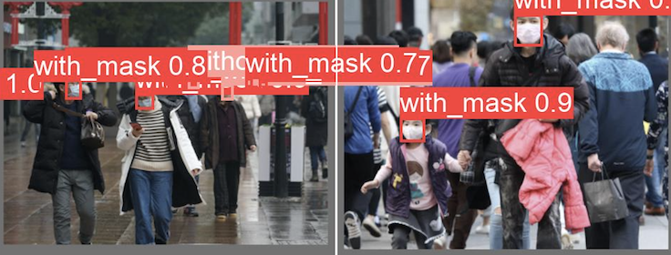
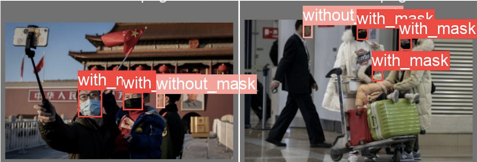
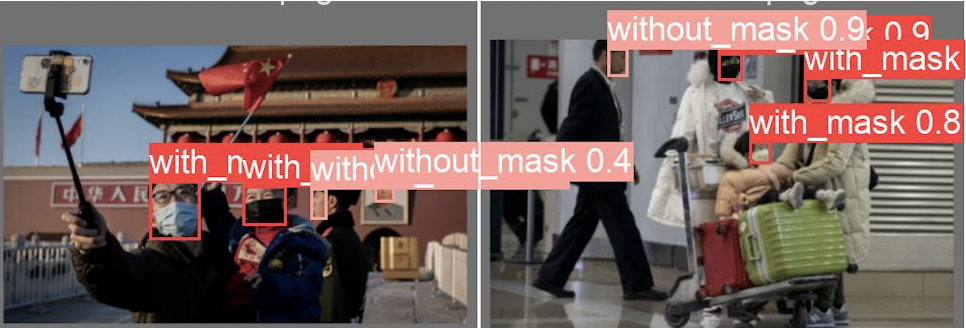

# Face Mask Detection

Face mask detection is an object detection task that detects whether people are wearing masks or not in videos. This repo includes a demo for building a face mask detector using YOLOv5 model.
<p align="center"> </p>

### Dataset

The model was trained on [Face-Mask](https://www.kaggle.com/andrewmvd/face-mask-detection) dataset which contains 853 images belonging to 3 classes, as well as their bounding boxes in the PASCAL VOC format. The classes are defined as follows:

* `With mask`
* `Without mask`
* `Mask worn incorrectly`

### Setup

This project supports **Windows**, **Linux**, and **macOS**. Choose the appropriate setup method for your operating system:

#### Quick Setup (Automated)

**For Windows (Command Prompt):**

```cmd
setup.bat
```

**For Windows (PowerShell):**

```powershell
.\setup.ps1
```

*Note: You may need to adjust execution policy first: `Set-ExecutionPolicy -ExecutionPolicy RemoteSigned -Scope CurrentUser`*

**For Linux/macOS:**

```bash
chmod +x setup.sh
./setup.sh
```

#### Manual Setup

**For Windows:**

```cmd
# Create and activate virtual environment
python -m venv .venv
.venv\Scripts\activate

# Install dependencies
pip install -r requirements.txt

# Install yolov5
git clone https://github.com/ultralytics/yolov5
cd yolov5
pip install -r requirements.txt
cd ..
```

**For Linux/macOS:**

```bash
# Create and activate virtual environment
python3 -m venv .venv
source .venv/bin/activate

# Install dependencies
pip install -r requirements.txt

# Install yolov5
git clone https://github.com/ultralytics/yolov5
cd yolov5
pip install -r requirements.txt
cd ..
```

For more detailed setup instructions, see [SETUP.md](SETUP.md).

**Windows Users**: See [WINDOWS_SETUP.md](WINDOWS_SETUP.md) for a comprehensive Windows-specific guide.

The project now includes:

* Real-time face mask detection using your computer's webcam
* Pre-trained YOLOv5 model for face mask detection
* Support for three classes: with mask, without mask, and mask worn incorrectly
* Data balancing tools to improve accuracy for underrepresented classes
* Enhanced error handling and robust configuration options

#### Data Preparation and Balancing

* Download [Face-Mask](https://www.kaggle.com/andrewmvd/face-mask-detection) dataset from Kaggle and copy it into `datasets` folder.
* Execute the following command to automatically unzip and convert the data into the YOLO format and split it into train and valid sets. The split ratio was set to 80/20%.

```
python prepare.py
```

* To address class imbalance (especially for the "mask worn incorrectly" class), you can use the data balancing script:

```
pip install albumentations
python balance_data.py --target-count 200
```

This will augment underrepresented classes to achieve more balanced training data.

#### Training

* Start training:

```
cd yolov5
python train.py --img 640 --batch 16 --epochs 100 --data ../mask_config.yaml --weights yolov5s.pt --workers 0
```

#### Inference

* If you train your own model, use the following command for inference:

```
python detect.py --source ../datasets/input.mp4 --weights runs/train/exp/weights/best.pt --conf 0.2
```

* Or you can use the pretrained model `models/mask_yolov5.pt` for inference as follows:

```
python detect.py --source ../datasets/input.mp4 --weights ../models/mask_yolov5.pt --conf 0.2
```

#### Real-time Webcam Detection

* You can use your computer's webcam for real-time face mask detection:

```
python webcam.py
```

* Additional options are available:

```
python webcam.py --help  # Show available options
python webcam.py --model models/mask_yolov5.pt  # Specify custom model
python webcam.py --conf-thres 0.6  # Set custom confidence threshold
python webcam.py --camera 1  # Use a different camera (if you have multiple)
```

* This will open your webcam and start detecting face masks in real-time. Press 'q' to quit the application.
* The application shows:
  * Green bounding box: Person wearing a mask correctly
  * Red bounding box: Person not wearing a mask
  * Yellow bounding box: Person wearing a mask incorrectly
  * FPS (Frames Per Second) in the top-left corner

### Results

The following charts were obtained after training YOLOv5s with input size 640x640 on the `Face Mask` dataset for 100 epochs.

<p align="center">
  
</p>

Precision-Recall (PR) measures the accuracy of bounding box overlap between predicted bboxes and ground truth bboxes.

| Precision Curve | Recall Curve | PR Curve |
| :-: | :-: | :-: |
| <p align="center"> </p> | <p align="center"> </p> | <p align="center"> </p> |

The following metrics were measured on the valid dataset containing 171 images. High precision and recall scores were obtained on `with mask` and `without mask` classes. However, the performance on `mask worn incorrectly` class was poor due to the imbalanced data.

| Class | #Labels | Precision | Recall | mAP<sup>val<br>0.5 | mAP<sup>val<br>0.5:0.95 |
| :-: | :-: | :-: | :-: | :-: | :-: |
| `with mask` | 630 | 0.94 | 0.9 | 0.95 | 0.64 |
| `without mask` | 104 | 0.86 | 0.82 |  0.9 |  0.6 |
| `mask worn incorrectly` | 20 | 0.72 | 0.3 | 0.43 | 0.24 |
| `total` | 754 | 0.84 | 0.67 | 0.76 | 0.49 |

Note: You can improve the performance of the "mask worn incorrectly" class by using the data balancing script.

#### Ground Truths vs Predictions

| Ground Truth | Prediction |
| :-: | :-: |
|  |  |
|  |  |
|  |  |

### Troubleshooting

If you encounter any issues, please check the following:

1. **Model not found error**:
   * Ensure the model file exists in the `models` directory
   * If training your own model, check that the training completed successfully

2. **Camera access issues**:
   * Ensure your webcam is properly connected
   * Try using a different camera ID with `--camera` flag
   * Check if another application is using the camera

3. **CUDA/GPU issues**:
   * Verify your CUDA installation with `nvidia-smi`
   * Ensure you have compatible PyTorch version for your CUDA version

For more troubleshooting tips, see [SETUP.md](SETUP.md).

### Reference

* [Darknet](https://github.com/pjreddie/darknet/blob/master/scripts/voc_label.py)
* [YOLOv5](https://github.com/ultralytics/yolov5)
